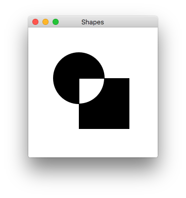
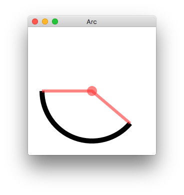
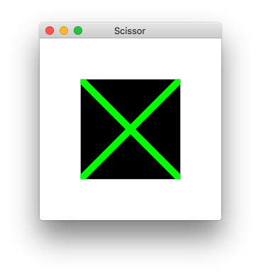

# Nim wrapper for NanoVG

NanoVG is small antialiased vector graphics rendering library for OpenGL. It has lean API modeled after HTML5 canvas API. It is aimed to be a practical and fun toolset for building scalable user interfaces and visualizations.

This nim wrapper removes the nvg prefex and makes the API look even more like HTML canvas api.

## API refrence:

https://treeform.github.io/nanovg/nanovg.html

## Usage

The NanoVG API is modeled loosely on HTML5 canvas API. If you know canvas, you're up to speed with NanoVG in no time.

### Drawing basic shapes: [shapes.nim](/tests/shapes.nim)
```nim
ctx.beginPath()
ctx.rect(100, 100, 100, 100)
ctx.circle(100, 100, 50)
ctx.pathWinding(CW) # Make circle as be a hole.
ctx.fillColor(RGBA(0, 0, 0, 255))
ctx.fill()
```


### Animation and more complex shapes: [arc.nim](/tests/arc.nim)
```nim
ctx.beginPath()
ctx.strokeColor(RGBA(0,0,0,255))
ctx.strokeWidth(10.0)
ctx.arc(xc, yc, radius, angle1, angle2)
ctx.stroke()

# draw helping lines
ctx.beginPath()
ctx.fillColor(RGBAf(1.0, 0.2, 0.2, 0.6))
ctx.strokeWidth(6.0)
ctx.arc(xc, yc, 10.0, 0, 2*PI)
ctx.fill()

ctx.beginPath()
ctx.strokeColor(RGBAf(1.0, 0.2, 0.2, 0.6))
ctx.arc(xc, yc, radius, angle1, angle1)
ctx.lineTo(xc, yc)
ctx.arc(xc, yc, radius, angle2, angle2)
ctx.lineTo(xc, yc)
ctx.stroke()
```


### Scissor - allows you to draw content inside other content: [scissor.nim](/tests/scissor.nim)
```nim
ctx.scissor(64*a, 64*a, 256 - 64*a*2, 256 - 64*a*2)

ctx.fillColor(RGBA(0,0,0,255))
ctx.beginPath()
ctx.rect(0, 0, 256, 256)
ctx.fill()

ctx.beginPath()
ctx.strokeColor(RGBA(0,255,0,255))
ctx.moveTo(0, 0)
ctx.lineTo(256, 256)
ctx.moveTo(256, 0)
ctx.lineTo(0, 256)
ctx.strokeWidth(10.0)
ctx.stroke()
```

